**声明：此文档由DKE收集整理于网络，例题实例皆为原创，仅用于交流学习目的，资源以及代码请勿用作它途。**

Internal table & External table implement
=========================================

创建Internal table
------------------

没有external修饰，表数据保存在Hive默认的路径下，数据完全由Hive管理，删除表时元数据和表数据都会一起删除。
```sql
CREATE TABLE [table name](
    [field 1]   [type],
    [field 2]   [type]
)
```
向Internal table中插入数据
--------------------------

-   插入一条数据
```sql
INSERT INTO [table name] values ([value 1], [value 2]…)
```
-   通过文件批量插入
```sql
CREATE TABLE [table name](
    [field  1]   [type],
    [field 2]   [type]
)
ROW FORMAT DELIMITED FIELDS TERMINATED BY ','
STORED AS TEXTFILE 
```
Append 数据到原表:

```sql
LOAD DATA LOCAL INPATH 'filepath in local file system' into TABLE [table name]
```

复写原本表中所有数据:

```sql
LOAD DATA LOCAL INPATH 'filepath in local file system'
OVERWRITE INTO TABLE [table name]
```

创建 External table
-------------------

有external修饰，表数据保存在HDFS上，该位置由用户指定。删除表时，只会删除表的元数据，所以外部表不是由Hive完全管理的'

-   通过指定文件创建
```sql
CREATE EXTERNAL TABLE [table name](
    [field 1]   [type],
    [field 2]   [type]
)
ROW FORMAT DELIMITED FIELDS TERMINATED BY ’separator’ 
STORED AS TEXTFILE 
LOCATION ’path on HDFS’
```

HQL Script的编写与使用
----------------------

-   编写\*

将HQL语句保存为'.hql'文件

-   运行

导航到hql文件的保存地址, 在命令行中输入:

!run \[script name\]

-   保存运行结果

!record \[report name\] \#指定输出文件名称

!run \[script name\] \#运行Script

!record \#结束并保存结果

数据类型
--------
>INT  
>FLOAT  
>DOUBLE  
>BOOLEAN  
>DECIMAL  
>STRING  
>DATE  
>ARRAY<type>  
>MAP<key_type, val_type>  
>STRUCT<Field_Name: datatype>  

Summary
-------
```sql
#默认建立内部表，加上external则是建立外部表
CREATE [external] TABLE if not exists student 
(
    [field 1] [type]
)
#下列参数若不指明则使用系统默认值
ROW FORMAT delimited fields terminated BY ',' #指定分隔符
lines terminated BY '\n'#指定换行符分隔符
stored AS textfile #指定最终表数据的存储格式，默认是textfile
location '/user/path...' #指定hive上表在hdfs上的存储路径，默认的是配置路径下[External Table一定要声明]
```

例
--

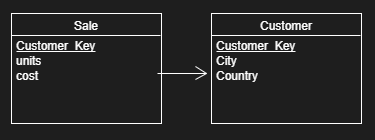

\$HIVE_HOME/bin/hiveserver2

\$HIVE_HOME/bin/hive \--service metastore

\$HIVE_HOME/bin/beeline

-   使用Internal Table 建立一些表, 并插入一些数据

-   使用External Table 建立一些表, 并插入一些数据

-   删除Internal Table 后查看数据是否还存在

-   删除External Table 后查看数据是否还存在

HQL中标准SQL不同/没有的语法
===========================

JOIN
----

INNER JOIN

OUT JOIN(Left, Right)

MAP JOIN: 适用于小表JOIN大表的场景

LEFT SEMI JOIN: 等同于Where \[field\] in/ Where exist

(HIVE中没有实现IN/EXISTS 的查询方法, 所以用SEMI JOIN 代替)
```sql
SELECT A.key, A.value FROM A WHERE A.key in
   (SELECT B.key FROM B);

SELECT A.key, A.val
   FROM A LEFT SEMI JOIN B on (A.key = B.key)
```

UNION & UNION ALL (并集)
------------------------

**UNION** removes duplicates, whereas **UNION ALL** does not.

纵向拼接两个表(列数必须一样)
```sql
SELECT A.key FROM A
UNION ALL
SELECT B.key FROM B
```

INTERSECT (交集)
----------------

{A,B,C}intersect{C,D,E} -\> {C}

HIVE**不支持**INTERSECT Operation

可以用LEFT SEMI JOIN代替

MINUS (差集)
------------

{A,B,C}-{C,D,E} -\> {A,B}

HIVE**不支持**MINUS Operation

可以用LEFT OUTER JOIN和IS NULL结合使用来实现

SORT BY
-------
```sql
SELECT … FROM A 
SORT BY [field]
```
HIVE特有, 和ORDER BY不同

ORDER BY是对全局进行排序

而SORT BY是对每个reducer的输出进行局部排序 (最终返回的全局结果并不有序)

\*set mapreduce.job.reduces=2;

DISTRIBUTE BY
-------------
```sql
SELECT … FROM A 
DISTRIBUTE BY [field]
```
使用HASH FUNCTION控制MAPPER的输出分配到REDUCER上(类似MR中Partitioner)

在特定需求下有用: 帮助提升Load Balancing

NOTE: 当DISTRIBUTE BY和SORT BY 同时使用时. DISTRIBUTE BY 必须写在SORT
BY之前

CLUSTER BY
----------

是对同一COLUMN调用DISTRIBUTE BY 和 SORT BY的简略写法

NOTE: 个别情况下能提升性能

LIMIT
-----
```sql
[SELECT STATEMENT] LIMIT 10;
```
返回结果的前N行

例 {#例-1 .list-paragraph}
--

-   通过LEFT SEMI JOIN实现两个表的交集

-   通过LEFT OUTER JOIN和IS NULL实现两个表的差集

AGGREGATION 
===========

高阶聚合函数

GROUPING SET
------------
```sql
select A, B, C, count(*) #[Aggregation Function]
from [tableName]
group by
grouping sets(
    (A,C), (A,B), (B,C), (C)
)
```
```sql
SELECT A, NULL, C, COUNT(*)
from [tableName]
group by (A,C)
    UNION
SELECT A, B, NULL, COUNT(*)
from [tableName]
group by (A,B)
    UNION
SELECT NULL, B, C, COUNT(*)
from [tableName]
group by (B,C)
    UNION
SELECT NULL, NULL, C, COUNT(*)
from [tableName]
group by C;
```
ROLL UP
-------
```sql
select A, B, C, COUNT(*) #[Aggregation Function]
from
    tableName
group by A,B,C WITH ROLLUP;
```
```sql
select A, B, C, COUNT(*) #[Aggregation Function]
from
    tableName
group by
grouping sets((A,B,C), (A,B), (A), ());
```
CUBE
----
```sql
select A, B, C, COUNT(*) #[Aggregation Function]
from
    tableName
group by A,B,C WITH CUBE;
```
```sql
select A, B, C, COUNT(*) #[Aggregation Function]
from
    tableName
group by
grouping sets((A,B,C), (A,B), (A,C), (B,C), (A), (B), (C), ());
```
例
--

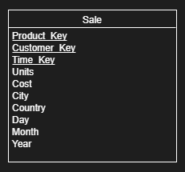

-   返回按 **国家**年份, 国家**年份**和**月份**, 国家年份月份和**日期**,
    国家, **全体数据** 进行聚合求AVG Cost的结果

> SELECT COUNTRY, YEAR, MONTH, DAY, AVG(COST) FROM SALE
>
> GROUP BY COUNTRY, YEAR, MONTH, DAY WITH ROLLUP;

-   返回按年份**月份**和**日期**, **年份**和月份, 月份和日期 以及
    按相同的年份, 月份, 日期, 和**全体数据** 进行聚合求Total Cost的结果

> SELECT YEAR, MONTH, DAY, SUM(COST) FROM SALE
>
> GROUP BY YEAR, MONTH, DAY WITHCUBE

-   返回按年份月份和日期, 年份和月份, 月份和日期 以及 按相同的年份,
    月份, 日期进行聚合求Total Cost的结果

-   返回 **年份城市**, **日期**城市, **产品ID**, **客户ID**,
    产品ID和客户ID 进行聚合求最大Units

-   的结果

WINDOW PARTITION
================

分组但不聚合 ROW FUNCTION

语法
----

>SELECT \[field1\], \[field2\] ...,  
>\[function 1\] **OVER** (PARTITION BY \[field\] ORDER BY \[field\] ROWS  
>\[Range\]),  
>\[function 2\] **OVER** (PARTITION BY \[field\] ORDER BY \[field\] ROWS  
>\[Range\])  
>FROM \[table name\]

Function
--------

### **AGGREGATES FUNCTION**

1)  **COUNT**(Field)

2)  **SUM**(Field)

3)  **MIN**(Field)

4)  **MAX**(Field)

5)  **AVG**(Field)

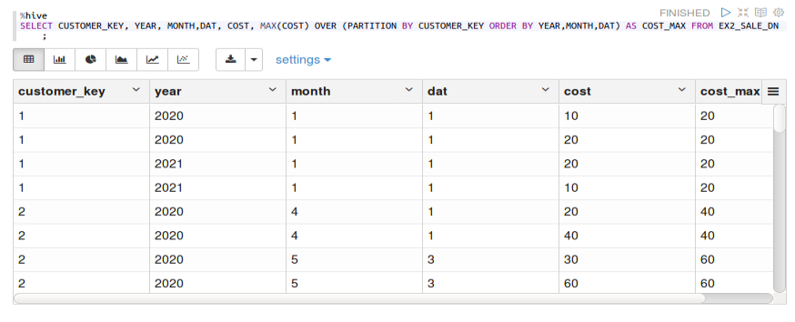

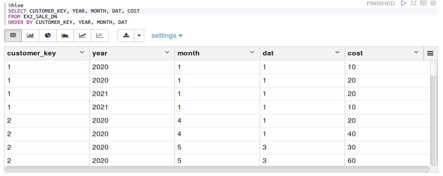

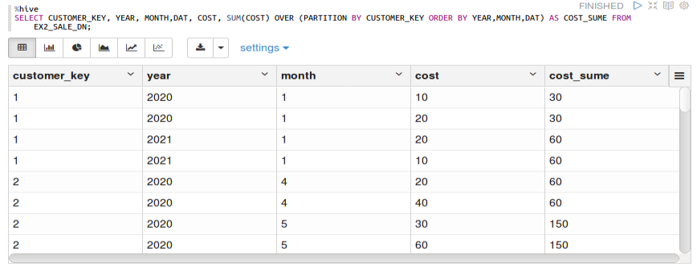

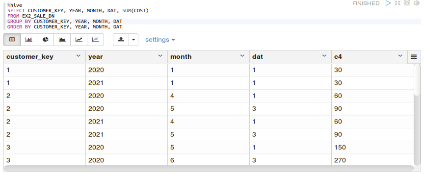

```sql
Sum(cost) over (partition by customer_key order by year,month,day rows
between current row and 1 preceding

Sum(cost) over (partition by customer_key order by year,month,day rows
unbounded preceding) //default

Sum(cost) over (partition by customer_key order by year,month,day rows
between current row and unbounded following)
```
**\* Window Range:** 对于AGGREGATES FUNCTION

\(n\) PRECEDING：往前\
(n) FOLLOWING：往后\
CURRENT ROW：当前行\
UNBOUNDED PRECEDING: 表示该窗口最前面的行（起点）\
UNBOUNDED FOLLOWING: 表示该窗口最后面的行（终点）

ROWS BETWEEN ... AND ...

\*unbounded following 似乎必须和rows between 一起使用

WINDOWN
FUNCTION的解释：在当前分组下，按指定的方式排序，以当前行为参照对RANGE
CONDITION内的行使用特定的function）

### **ANALYTICS FUNCTION**

1)  **ROW_NUMBER()**

给当前分区内的行按顺序标号

2)  **RANK()**

3)  **DENSE_RANK()**

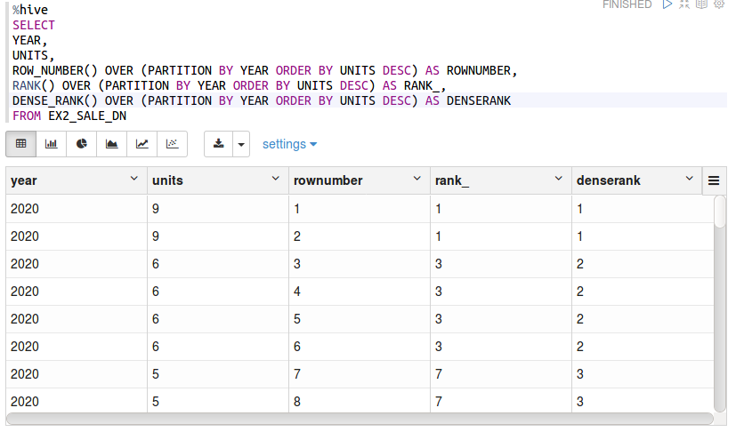

1)  **PERCENT_RANK()**

\[分组内当前行的RANK值-1\]/\[分组内总行数-1\] 之比

1)  **CUME_DIST()**

\[小于等于当前值的行数\]/\[分组内总行数\]之比

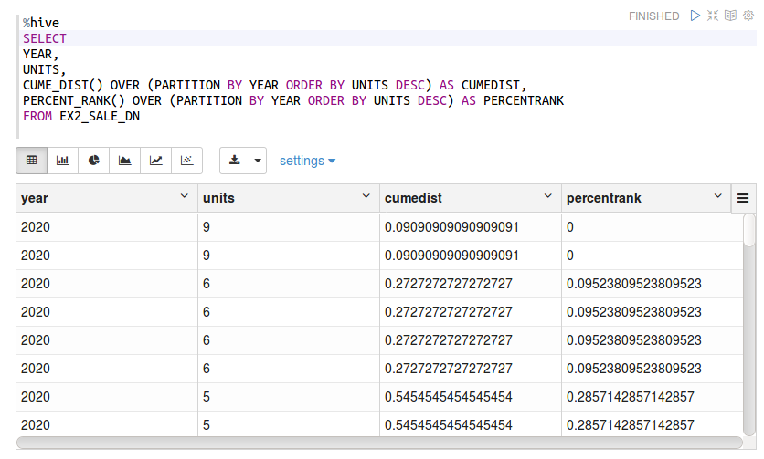

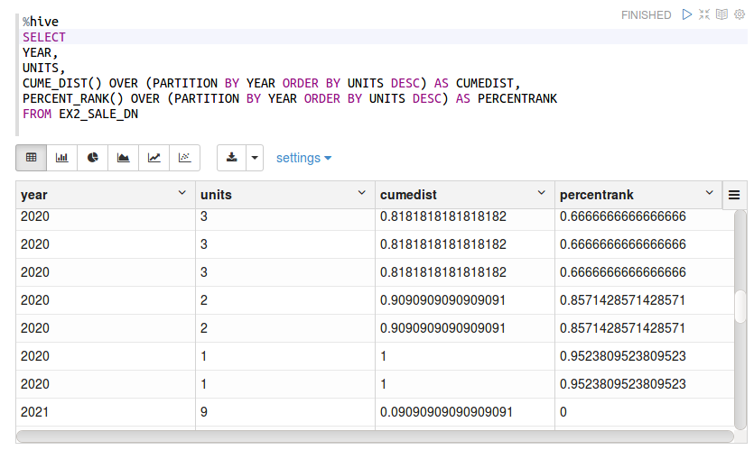

1)  **NTILE(n)**: 按顺序将数据分成n组。

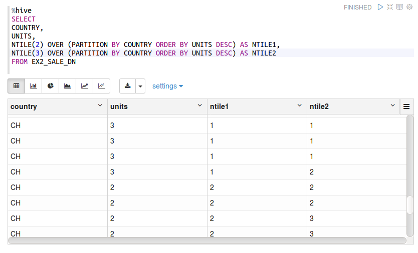

### **WINDOW FUNCTION**

3)  **LEAD**(field,n,DEFAULT): 取统计窗口中当前行**后**第n行field中的值

field: 取哪一列

n: 取后n行的值

DEFAULT: 当值为NULL时的默认值（例如当取最后一行的下一行时，
取不到数据时设置的默认值）

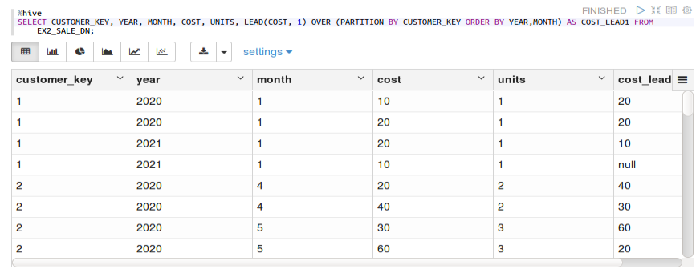

1)  **LEG**(field,n,DEFAULT): 取统计窗口中当前行**前**第n行field中的值

2)  **FIRST_VALUE**(field, bool): 取当前分组排序后第一行field中的值

field: 取哪一列

bool: 是否忽略空值

6)  **LAST_VALUE**(field, bool): 取当前分组排序后最后行field中的值

例 {#例-3 .list-paragraph}
--

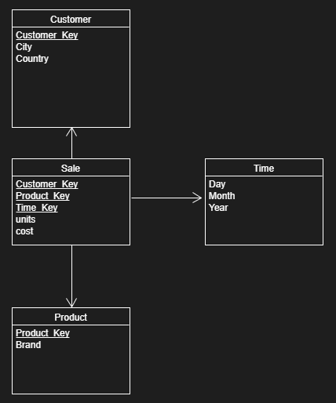


-   **对每一个顾客ID, 产品ID, 购买量, 打印出该城市中最大的购买量,
    该年份中开销最高的COST.**

> Select customer_key, product_key, units,
>
> Max(units) over (partition by city),
>
> Max(cost) over (partition by year)
>
> From sale;

-   **打印出年份和月份，
    并计算每个年份中当前月份以及之前月份units的平均数**

> Select year, month,
>
> avg(units) over (partition by year order by month rows unbounded
> preceding)
>
> from sale;

-   **打印出年份和月份， 并计算每个年份中当前月份前后两个月份Cost的**

> Select year, month,
>
> avg(units) over (partition by year order by month rows between 2
> preceding and 1 preceding)
>
> from sale;

-   **打印出年份和月份， 并计算每个年份中当前月份以及之后月份units之和,
    再筛选出units 之和大于1000的记录**

> Select \* from(
>
> Select year, month,
>
> sum(units) over (partition by year order by month rows between current
> rows and unbounded preceding) as unitsavg
>
> from sale
>
> )T
>
> Where unitsavg \> 10

-   打印出Customer key和购买金额和年份，
    并对他在**一年**中的消费记录按金额进行排名从大到小（rank）

> Select customer_key, cost, year,
>
> rank() over (partition by year order by cost des)
>
> from sale;

Partition
=========

建立一个分区表
--------------

```sql
CREATE TABLE [table name](
    [field 1]   [type],
    [field 2]   [type]
)
partitioned by ([field 3] [type])
ROW FORMAT DELIMITED FIELDS TERMINATED BY ','
```

创建分区
--------

```sql
alter table [table name] add partition ([field 3] = value)
```

插入记录到某分区前，必须先创建分区

查看已创建的分区
----------------

```sql
show partitions [table name]
```

往指定分区中插入数据
--------------------
```sql
insert into [table name] partition ([field 3] = partition name) values (.)
insert into [table name] partition ([field 3] = partition name) [select statement] 
```

动态建立分区参数
----------------

set hive.exec.dynamic.partition.mode = nonstrict

set hive.exec.max.dynamic.partitions=5

例 {#例-4 .list-paragraph}
--


建立一个Partition Table, 按年份分区, 并插入数据

Bucket
======

创建Bucket表
------------

```sql
CREATE TABLE [table name](
    [field 1]   [type],
    [field 2]   [type]
)
cluster by ([field i]) into n buckets
ROW FORMAT DELIMITED FIELDS TERMINATED BY ','
```

通过HASH对数据按第i个field进行划分， 分成n个组

用hash结果除以桶的个数做取余运算的方式来分桶，保证了每个桶中都有数据，但每个桶中的数据条数不一定相等。

例 {#例-5 .list-paragraph}
--


建立一个Bucket Table, 按年份分块, 并插入数据

Reference
====

<https://docs.oracle.com/cd/E41507_01/epm91pbr3/eng/epm/penw/concept_MultidimensionalWarehouseMDW-9912e0.html>
